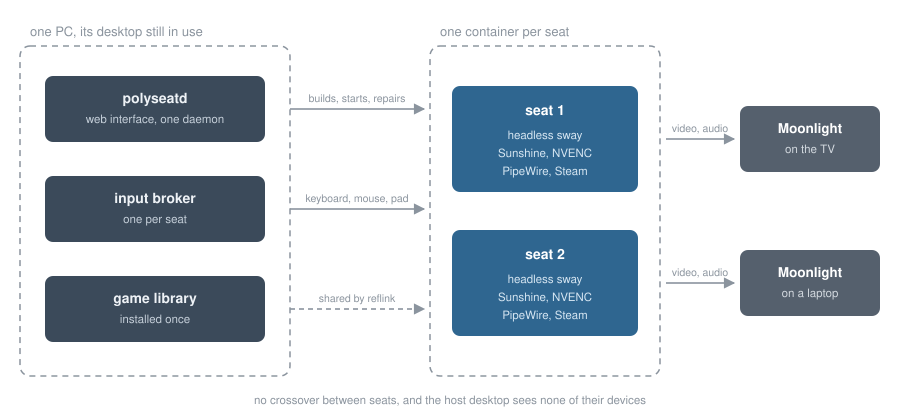

# Polyseat

**Several people playing on one Linux PC at the same time.** Each in their own
isolated session with their own Steam account, their own controller and their
own screen, streamed to their own Moonlight client. The machine's regular
desktop keeps running undisturbed while they play.

A **seat** is an Incus system container with its own headless Sway, its own
Sunshine instance, its own PipeWire and its own Steam account. One GPU serves
all of them through NVENC.

Polyseat implements **neither a compositor, nor an encoder, nor a streaming
protocol**. The heavy lifting is done by Incus, Sway/wlroots, Sunshine,
PipeWire, udev and systemd. Polyseat is the orchestrator on top: it builds
seats, wires them up collision-free, assigns input devices, shares the game
library, and repairs what drifts.



## What it does

**Seats are built in one click and play in parallel.** `polyseatd` takes a seat
from nothing to a running session: container, network, driver userspace, Steam,
desktop, input broker. It supervises the brokers, follows the Incus event stream
instead of polling, and converges seats that were built by an older recipe, so a
change to the recipe reaches the seats that already exist.

**Input goes exactly where it belongs.** Each client's keyboard, mouse and
gamepad reach that client's session and nothing else. No crossover between
seats, and the host desktop never sees any of them: a controller plugged in for
seat 2 does not steer the host's Steam. Ownership is established structurally,
from what the kernel says created a device, rather than from the name the device
claims to have.

**A game installed once is playable in every seat**, without being downloaded
again, and that includes the games that were already on the machine. Each seat
keeps its own private, fully writable library; the daemon replicates game
directories between them with reflinks, so the copies share their blocks on
disk. Taking this machine's 69 GB library into the pool took 0.8 seconds and
cost 432 KB. It keeps working after an update, because the host's library is
watched rather than imported once, and a seat that is behind is brought forward
as soon as nothing in it is using the shared files.

**Launchers other than Steam work too.** Each seat has a `shared/` directory
where one folder is one game; point Heroic, Lutris or Bottles at it and the game
appears in the other seats by itself.

**A seat is something you can sit down in front of.** Connecting lands on a
desktop with an application launcher, a bar and a file manager, not on a bare
terminal. Moonlight's app list is generated from what the seat really has, with
box art, so Steam Big Picture, any installed launcher and the installed games
themselves are one pick away before a stream even starts. Software goes in from
either end with no password and no root: the player types `flatpak install ...`
in the seat, or somebody installs it into that seat from the Polyseat web
interface and watches the progress bar.

**Every client gets the picture it asked for.** The seat's output is virtual, so
it simply becomes the size the client wants, at the refresh rate the client
wants. The framerate is capped from outside rather than by turning vsync on,
which is what RTSS does on Windows: the games stay uncapped and pay no vsync
latency, and one setting covers native games, Proton, flatpak launchers and
emulators alike. Measured in a seat: 14866 fps uncapped becomes 60.00 fps with a
60 Hz client, at 0.03 ms of frametime jitter against 0.40 ms for vsync alone.

**A controller is enough.** Streaming from an Apple TV or a phone means no
keyboard and no mouse, and neither Moonlight nor Steam can supply them for a
launcher's login form. So the seat carries both: an on-screen keyboard, and a
pointer driven by the gamepad, left stick to move and right stick to scroll.
Nothing happens until Select and Start are pressed together, so a controller in
a game stays a controller.

Confirmed on real hardware, most recently on 2026-07-29. The logs of each step
live in [`spike/`](spike/) and record what works, what does not, and why.

## Requirements

| | |
|---|---|
| **Host** | Arch-based. The installer queries `pacman` rather than pretending to be portable. |
| **Packages** | `incus`, `nvidia-container-toolkit`, `bpftrace`, `python`, `go`. The installer installs whichever of them are missing. |
| **GPU** | NVIDIA. The encoder is NVENC and the seats are given the NVIDIA userspace directly. |
| **Filesystem** | btrfs, or XFS created with `reflink=1`, **and only for the shared game library**. `ext4` cannot share blocks, and neither can tmpfs or a network filesystem. Seats still work on those; the shared library simply stays off and every seat downloads its own games. The installer tests it and says which it found. |
| **Network** | One interface the seats can take a macvlan from, so each seat is a host of its own on the LAN and can use the standard Sunshine ports. |

## Running it

**Once per machine:**

```
sudo host/install.sh
sudo systemctl enable --now polyseatd
```

That installs any missing packages, gives root the idmap range every container
start needs, brings up Incus and initialises it if nobody has, builds the
daemon, places the input helpers under `/usr/local/lib/polyseat`, installs the
udev rule that keeps seat devices off the host desktop, registers one systemd
unit, and adds your account to the `input` group so the host-side tooling runs
without root. It creates no seats, and it can be run again after an update
without undoing anything.

Two things it reports rather than changes, because they are yours to decide:

* **Whether the game library can share blocks.** It asks the filesystem by
  cloning a file rather than trusting its name, so an XFS made without
  `reflink=1` is caught as well as an `ext4`. On a no it says so and carries on;
  everything except the shared library works either way.
* **Whether the seats have an uplink.** They each get a macvlan interface, which
  needs a default route to take it from and does not work on wifi at all,
  because 802.11 does not carry more than one MAC address per association.

**Everything else happens at `https://<this machine>:47800`.** Nobody has
claimed the machine yet, so the page asks you to choose a password rather than
to type one, the way Sunshine's own interface does. Do it before anybody else
does: until it is set, whoever reaches the page can set it. Then add a seat and
press provision. The
daemon downloads the image, installs the packages, repairs the NVIDIA userspace
that the driver injection leaves incomplete, generates the Sunshine
configuration and starts the session.

**Pairing a device** happens under *Devices and pairing* on the seat's card.
Point Moonlight at the seat, type the PIN it shows into that field, done. The
same panel lists what is already paired and can unpair it, and shows the seat's
own Sunshine login for when you want to go there directly. Pairing is done here
for every seat rather than in one Sunshine page per seat on a port of its own:
the daemon owns each seat's Sunshine login and talks to it on your behalf.

The interface answers on the whole network, so seats can be managed from the
same phone that runs Moonlight. The certificate is self signed, so the browser
asks once, exactly like Sunshine's own interface does. To keep it on this
machine instead, set `listen` to `127.0.0.1:47800` in
`/etc/polyseat/polyseatd.json`.

**Reading what happened.** Each seat card carries its own log, and the useful
lines in it come from the input broker. It says for every device whether its
owner was verified structurally, correlated, or merely claimed by name:

```
+ event29    Keyboard passthrough (seat2)
  creator verified: ID_INPUT=1 ID_INPUT_KEY=1 ID_INPUT_KEYBOARD=1
! event260   refused: name claims (seat1) but the kernel says 'seat2' created it
```

The other line worth watching is the encoder. A seat whose EGL landed on Mesa
still starts, still streams and still looks healthy; it just encodes in
software. The card shows `nvenc` and the codecs it can offer when it is right,
and says so plainly when it is not.

For the host itself:

```
host/check-hardening.sh     # console and device exposures
journalctl -fu polyseatd
```

## What it does not do

It does not share licences: a seat can only play what its own account owns. It
is built for trusted local users on one machine, not for handing a seat to a
stranger over the internet. And it does not hide a missing reflink filesystem
behind full copies: the daemon says so plainly instead.

## Reading further

Architecture and the reasoning behind every decision:
[`docs/architecture.md`](docs/architecture.md). What the isolation actually
guarantees, measured rather than assumed: [`docs/security.md`](docs/security.md).
Who installs what, and where the line between installer, daemon and interface
runs: [`docs/installation.md`](docs/installation.md).

## Roadmap

| | | |
|---|---|---|
| **M0** | Input spike: does the container architecture hold up? | ✅ |
| **M1** | One seat: Sway + Sunshine + NVENC + Moonlight | ✅ |
| **M2** | Input broker: keyboard, mouse and pad reach the seat | ✅ |
| **M3** | A seat that actually plays: Steam, Proton, pad, audio | ✅ |
| **M4** | Two seats in parallel, input strictly separated | ✅ |
| **M5** | Daemon + GUI: create, start, pair and monitor seats | ✅ |
| **M6** | Shared game library: install once, play in every seat | ✅ |
| **M7** | A usable seat: desktop, app list, software, resolution and framerate per client | ✅ |

## License

GPL-3.0-or-later. See [LICENSE](LICENSE).
